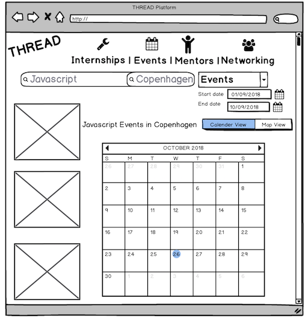
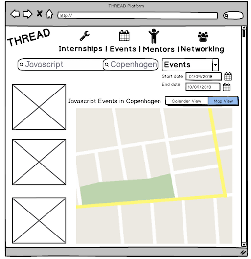
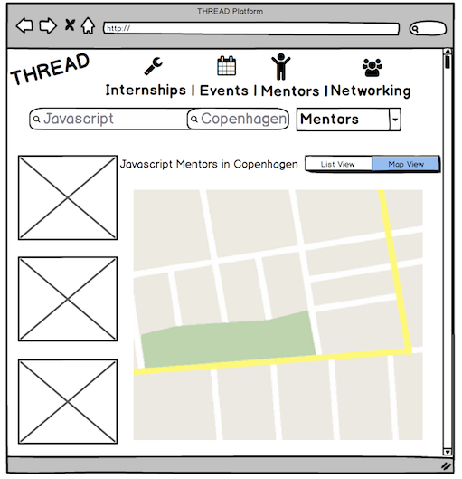
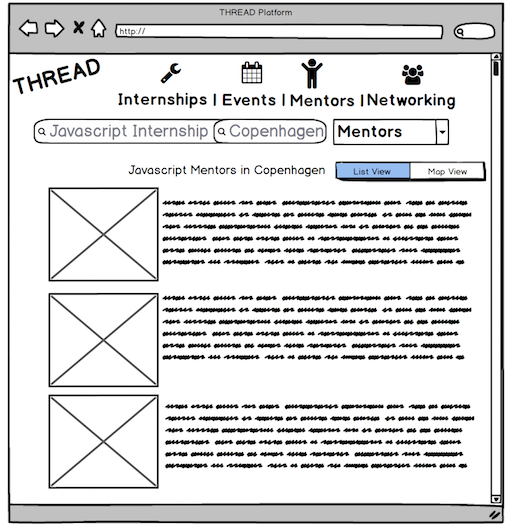

This project was bootstrapped with [Create React App](https://github.com/facebookincubator/create-react-app).

View can found of Heroku [Heroki Link](https://hyf-class5-final.herokuapp.com/)
Below you will find some information on how to perform common tasks. 
You can find the most recent version of this guide [here](https://github.com/facebookincubator/create-react-app/blob/master/packages/react-scripts/template/README.md).

## Table of Contents

- [Available Scripts](#available-scripts)
  - [npm run build](#npm-build)
  - [npm start](#npm-start)
  - [npm run client](#npm-run-client)
  - [npm run server](#npm-run-server)
    - [npm run dev](#npm-run-dev)

## The Customer - THREAD 

#### THREAD stands for Textile Hub for Refugee Empowerment, Employment & Entrepreneurship Advancement in Denmark

THREAD is a dynamic and innovative collaboration of diverse partners from business, design, education, research and refugee support agencies aiming to achieve life-changing results for women who are forging new lives in Denmark.

Learn more about our customer here: https://ctr.hum.ku.dk/research-programmes-and-projects/thread/

## The Project Description

### The goal for this project is to develop an online platform to facilitate the connections between refugee women and individuals or partners or other organisations which share an interest in textiles and craft activity. The partners or other organisations are part of the THREAD network therefore they will be metioned as networking.

Due to the complexity of this project we will only develop a platform where Internship, Events, Calendar, Networking(Partners and other Organisations) and Individuals, which will be called Mentors for now on, will be available to be searched upon, listed and also inserted in the system. The goal is to built the List Views and Insert Views related to these objects and make is possible to search by text and visualize them in a Map.

## Work stories

### First iteration

##### 1A: When I want to find a specific Internship Ad I want to be able to search for the title and location at the same time;
##### 1B: When I want to find a specific Event I want to be able to search for the title, location and date range at the same time;
##### 1C: When I want to find a specific Mentor I want to be able to search for the title and location at the same time;
##### 1D: When I want to find a specific type of Networking I want to be able to search for the name and location at the same time;

###### Build an UI using the mockup below as a guideline for:

      > A Search View which will also be the Home Page View - use https://storybook.js.org/
      and build the components for the view. 

      > A Search by text Result View - use https://storybook.js.org/ and build the
      components for the view. 
      Note: Start date and end date pickers should be available if Event is selected.

      > A Result View with 2 different sub Views for Events, one with results on the Map 
      and another with results on a calendar - use https://storybook.js.org/ and 
      build the components for the view. 

      > A Result View with 2 different sub Views for Mentors Search Results, one with 
      results on the Map and another with results on a calendar - use https://storybook.js.org/
      and build the components for the view. 

Note: use the same logic and UI of the Mentors Results View for the Networking Results View

### Second iteration

      > Build Menu View with React based on the components previously created with the Storybook.io;

      > Build List Views with React using the APIs structure for Internship ads, Events , Mentors and 
      Networking and using the components that you created with Storybook.io;
            Note #1: The availabilities of the Mentors should be listed;
            Note #2: The search boxes don't need to be part of the Views in this stage because we are only 
            developing Listing and not Search.

      > Build List View for the Calendar using the API's structure for Events;

      > Build List View for the Map using the API's structure for Events pinned them down on the map.
            Note #3: Beware that even though the Mockups show several Maps, this exercise is only for Events.
      
      > Extra 
            > Build a Footer with 4 new Items:

            * About us with the following content:

                  Textile Hub for Refugees' Empowerment, Employment 
                  and Entrepreneurship Advancement in Denmark - a 
                  new model

                  THREAD is a dynamic and innovative collaboration
                  of diverse partners from business, design, education, 
                  research and refugee support agencies aiming to 
                  achieve life-changing results for women who are 
                  forging new lives in Denmark.

                  Integration is a key problem for refugees and their 
                  host countries. This project seeks to help solve this
                  problem by developing and testing a pioneering 
                  themed model of Empowerment, Employment and 
                  Entrepreneurship opportunities. The model offers 
                  a step-change programme to women refugees with 
                  differing levels of life experience and educational 
                  qualifications, which may be accessed according to 
                  their individual confidence and competence.

                  The project is funded by Innovationsfonden.

            * Contact with the following content:

                  Jane Malcolm-Davies, Director
                  Centre for Textile Research
                  University of Copenhagen
                  Tel.: +45 26 20 22 09
                  E-mail: jane@jmdandco.com

                  Egzona Haxha, Co-Director
                  Centre for Textile Research
                  University of Copenhagen
                  Tel.: +45 60 86 32 17
                  E-mail: egzona@hum.ku.dk

            * Developed by

                  Group # for the Final Project Class at
                  Hack Your Future - Copenhagen
                  http://hackyourfuture.dk/
            
            * Facebook

            Thread facebook page
            https://www.facebook.com/threadcopenhagen/

            Note: the items that actually have content should
            show the content itself in a detail view.

###### Please check the JSON files provided through APIs

API for Internship https://my.api.mockaroo.com/internship.json?key=d38d0f10

API for Events https://my.api.mockaroo.com/events.json?key=d38d0f10

API for Mentors https://my.api.mockaroo.com/mentor.json?key=d38d0f10

API for Networking https://my.api.mockaroo.com/networking.json?key=d38d0f10

###### Images given by THREAD

###### Logo 
https://s3.us-east-2.amazonaws.com/hyf-thread-class05/thread-logo.png

###### Internships 
https://s3.us-east-2.amazonaws.com/hyf-thread-class05/thread-internship-1month.JPG

https://s3.us-east-2.amazonaws.com/hyf-thread-class05/thread-internship-3months.jpeg

###### Events
###### Lecture   
https://s3.us-east-2.amazonaws.com/hyf-thread-class05/thread-event-lecture.jpg

###### Catwalk   
https://s3.us-east-2.amazonaws.com/hyf-thread-class05/thread-event-catwalk.jpg

###### Workshops 
https://s3.us-east-2.amazonaws.com/hyf-thread-class05/thread-event-workshop1.jpg

https://s3.us-east-2.amazonaws.com/hyf-thread-class05/thread-event-workshop2.JPG

https://s3.us-east-2.amazonaws.com/hyf-thread-class05/thread-event-workshop3.jpg

###### Recruitment 

https://s3.us-east-2.amazonaws.com/hyf-thread-class05/thread-recruitment.jpg

###### Research 

https://s3.us-east-2.amazonaws.com/hyf-thread-class05/thread-research.jpg

### Iteration 3
1. Refactor file structure of your project so that you can have React and ExpressJS code in the same repository.
2. Based on the sample API endpoints, design SQL tables for following entities:
      1. `Internship`
      2. `Event`
      3. `Mentor`
      4. `Networking`
3. Implement following REST endpoints for each of the above entities uing Express
      1. `GET /api/<entity_type>` - Get all entities of that type
      2. `POST /api/<entity_type>` - Create a new entry for that entity type
      3. `GET /api/<entity_type>/:id` - Get one entity of that type for given `id`
      4. `PUT /api/<entity_type>/:id` - Update one entity of that type for given `id`
      5. `DELETE /api/<entity_type>/:id` - Delete one entity of that type for given `id`

      *NOTE: Deletion should be soft, i.e. objects should be marked as inactive instead of deleting them permanently from the database.*
4. Replace Mockaroo endpoints by the new endpoints you in your REACT app.
5. Deploy everything to Heroku.
